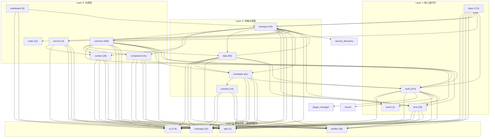

# pub/sub-loop 模块依赖关系图

> 生成时间：2026-07-10 | 分析方法：P0+P1 PRD body 跨模块引用提取

---

## 一、依赖关系总览

以下依赖关系通过分析所有 P0（56 项）和 P1（158 项）PRD 的描述文本，提取跨模块引用得出。箭头方向为 **A → B 表示 A 依赖 B**。



---

## 二、被依赖度排名（关键基础模块）

一个模块被越多上层模块依赖，其稳定性和优先级就越关键。

| 排名 | 模块 | 被依赖次数 | 自身 PRD 数 | 稳定性风险 |
|------|------|-----------|------------|-----------|
| 1 | task | 15 | 2 | ⚠️ 极高：仅 2 个 PRD 却被 15 个模块依赖，定义不充分 |
| 2 | io | 14 | 179 | 中：PRD 充足但 162 项仍 Todo |
| 3 | profiler | 13 | 39 | 中：被广泛依赖但非阻塞路径 |
| 4 | message | 13 | 22 | ⚠️ 高：状态类型和序列化是传输基础，仅 22 PRD |
| 5 | tools | 7 | 374 | 低：工具链依赖为构建时依赖 |
| 6 | time | 5 | 26 | 中：时间系统影响调度和数据管道 |
| 7 | transport | 4 | 30 | ⚠️ 高：核心传输层，21 项 Needs Triage |
| 8 | event | 3 | 1 | ⚠️ 极高：仅 1 个 PRD 却被 3 模块依赖 |
| 9 | scheduler | 3 | 61 | 低：进展健康（29 In Progress） |
| 10 | base | 3 | 173 | 低：体量大，进展稳定 |

---

## 三、关键依赖路径分析

### 路径 1：个体状态发布 → 世界快照（最关键路径）

```
individual publishes state
    → message (序列化 IndividualState)
    → transport (RTPS / 共享内存传输)
        → base (内存对齐、原子操作)
        → scheduler (dispatch 调度)
    → data (ChannelWriter → 融合引擎)
        → time (时间戳排序)
    → WorldView (一致世界快照)
```

**阻塞风险**：transport 模块 21/30 项为 Needs Triage，直接威胁此路径。

### 路径 2：世界快照 → Web 渲染

```
data::WorldView
    → [L3-001] State Bridge (WebSocket DeltaFrame)
    → [L3-002] DeltaFrame 二进制协议
    → needle-tools (GLB/3D 渲染)
```

**阻塞风险**：L3-001 和 L3-002 均为 Todo 状态，依赖 Phase 1A 完成。

### 路径 3：跨平台初始化

```
mainboard (world-bootstrap 脚本)
    → transport (检测并选择传输后端)
    → io (加载个体配置)
    → node (按依赖序启动个体节点)
    → scheduler (启动 tick-loop)
```

**阻塞风险**：mainboard 3 项全 In Progress，但依赖的 transport 分诊未完成。

---

## 四、循环依赖风险

| 循环 | 路径 | 严重度 |
|------|------|--------|
| transport ↔ data | transport 依赖 data（缓冲），data 依赖 transport（传输） | ⚠️ 需要明确接口边界 |
| common ↔ transport | common 依赖 transport，transport 依赖 common | ⚠️ 需要抽象层打破 |
| base ↔ transport | base 依赖 transport，transport 依赖 base | 中：base 为底层库，transport 依赖合理；反向依赖需检查 |

---

## 五、构建顺序建议

基于依赖拓扑排序，推荐以下模块构建顺序：

```
Round 1（无依赖/被依赖最多）: task, event, message, io, profiler
Round 2（依赖 Round 1）:       base, time, tools
Round 3（依赖 Round 1-2）:     transport, croutine, scheduler
Round 4（依赖 Round 1-3）:     data, context, component
Round 5（依赖 Round 1-4）:     common, node, service, mainboard
Round 6（全栈集成）:           L3 State Bridge, needle-tools 集成
```

---

## 六、模块健康度矩阵

| 模块 | PRD 数 | Done | In Progress | Blocked | Needs Triage | 健康度 |
|------|--------|------|-------------|---------|-------------|--------|
| transport | 30 | 0 | 6 | 0 | 21 | 🔴 危险 |
| task | 2 | 0 | 0 | 0 | 0 | 🔴 定义不足 |
| event | 1 | 0 | 0 | 0 | 0 | 🔴 定义不足 |
| message | 22 | 0 | 7 | 1 | 0 | 🟡 注意 |
| data | 90 | 0 | 19 | 0 | 0 | 🟡 注意 |
| io | 179 | 1 | 6 | 2 | 1 | 🟡 注意 |
| scheduler | 61 | 0 | 29 | 0 | 0 | 🟢 健康 |
| croutine | 14 | 0 | 11 | 0 | 0 | 🟢 健康 |
| base | 173 | 1 | 28 | 2 | 5 | 🟢 健康 |
| common | 494 | 2 | 42 | 12 | 6 | 🟡 注意 |
| mainboard | 3 | 0 | 3 | 0 | 0 | 🟢 健康 |
| component | 41 | 0 | 13 | 0 | 0 | 🟢 健康 |
